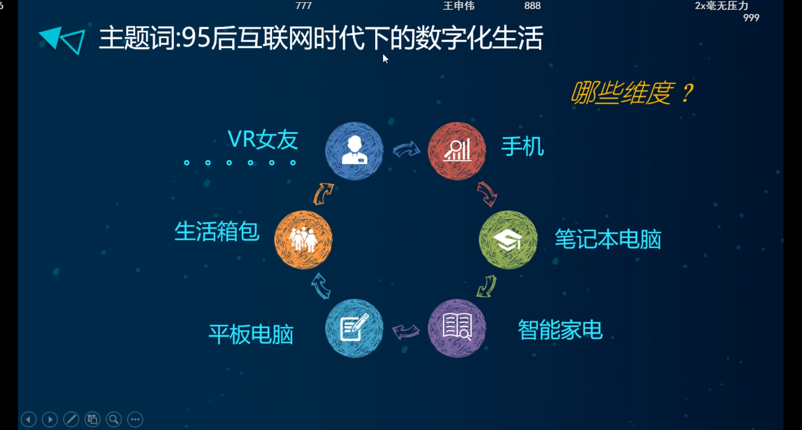

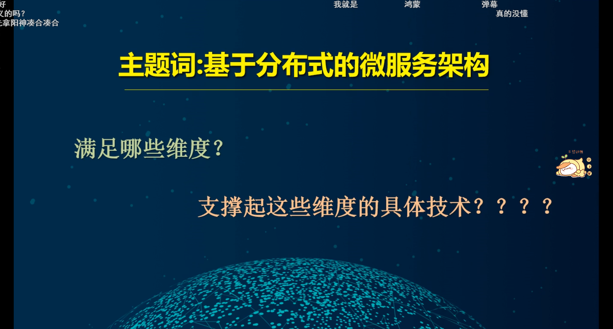

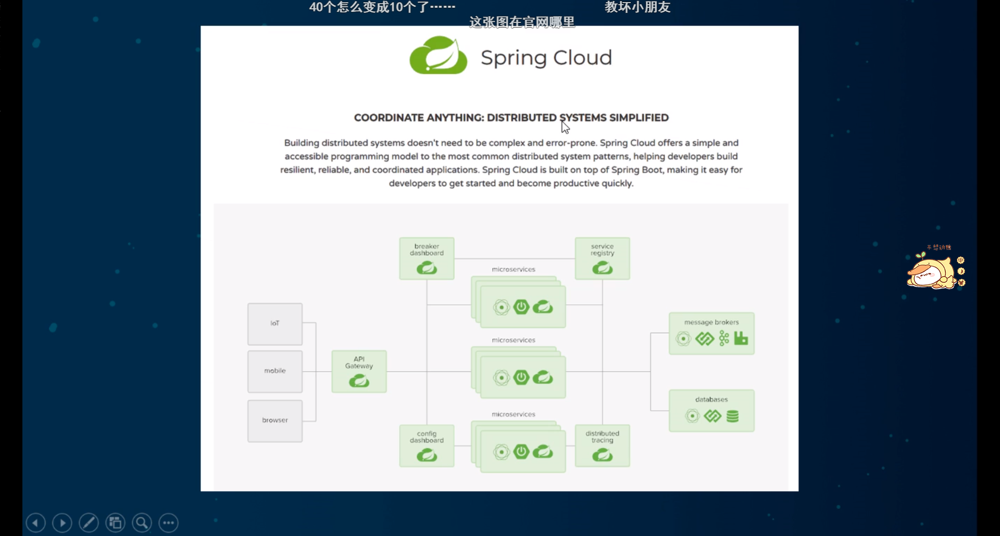

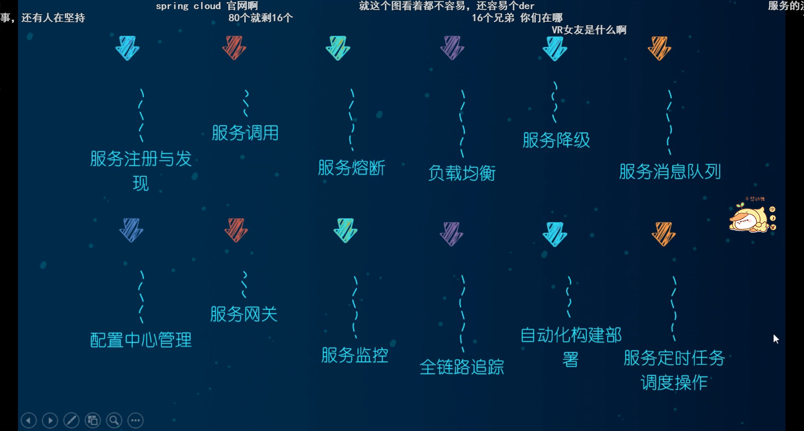

分布式架构的优势不是单一的,而是集中的

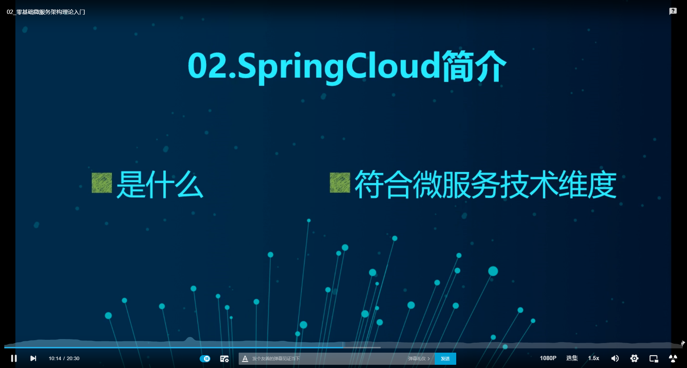

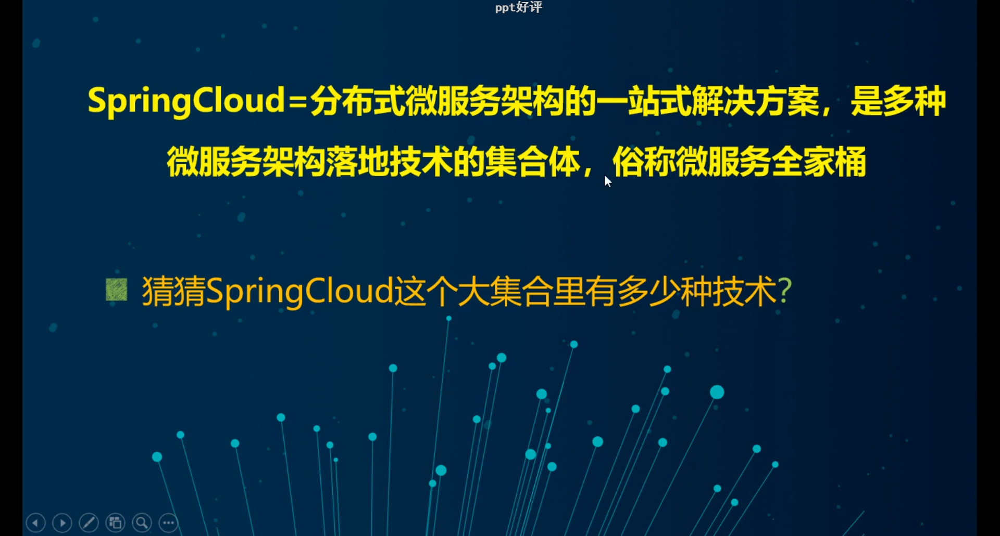

cloud是一系列的全家桶的整合,全栈式的解决方案

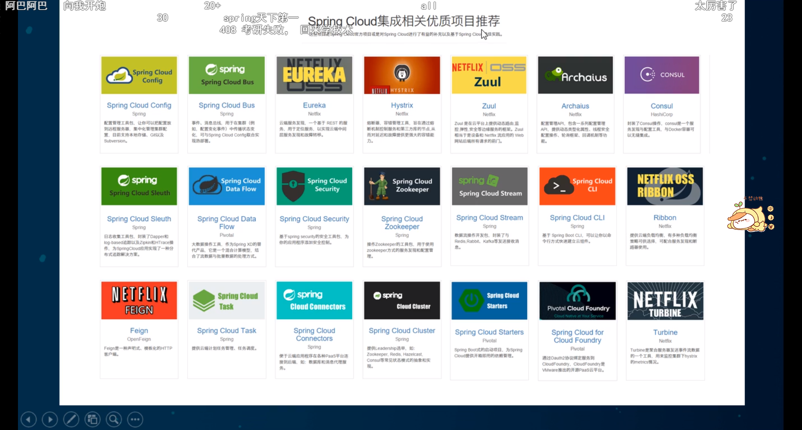

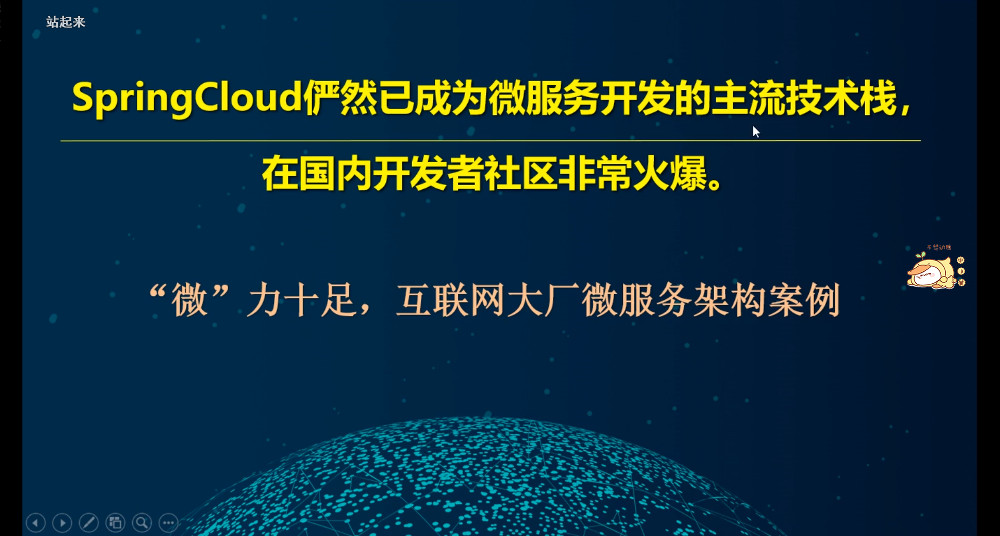

2018年京东的促销节

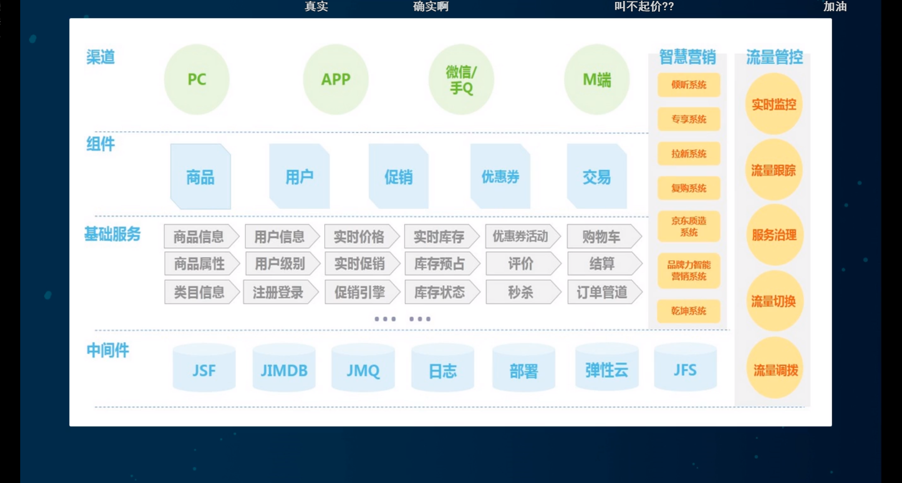

阿里的架构
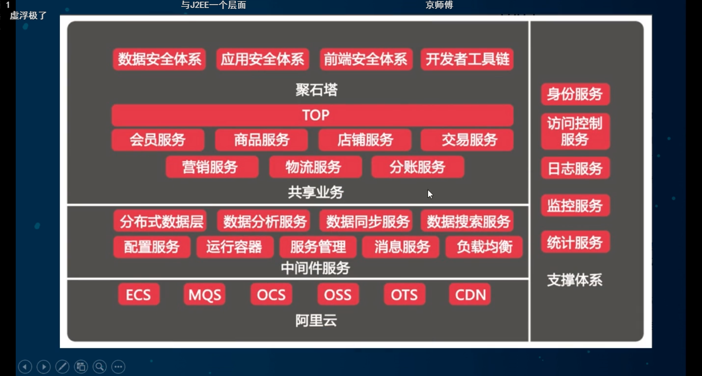

京东物流
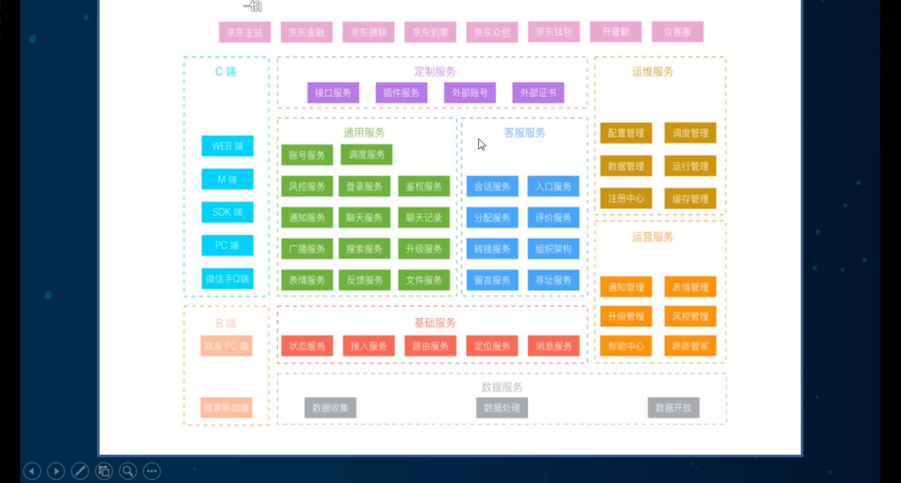
分布式的架构是目前的大势所趋

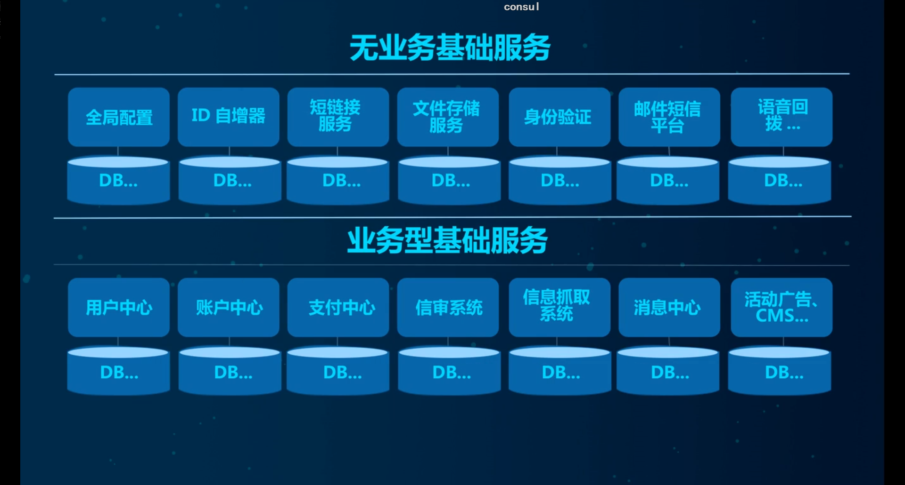

业务相关&业务无关彻底分离

微服务之间的调度,共享

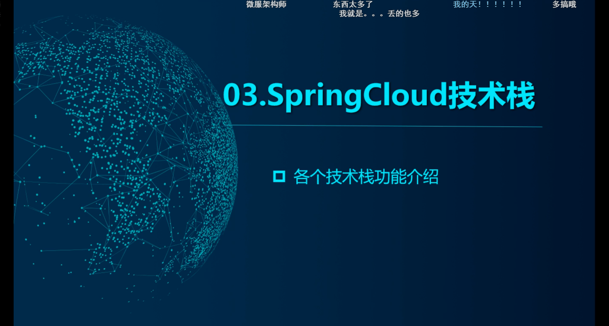

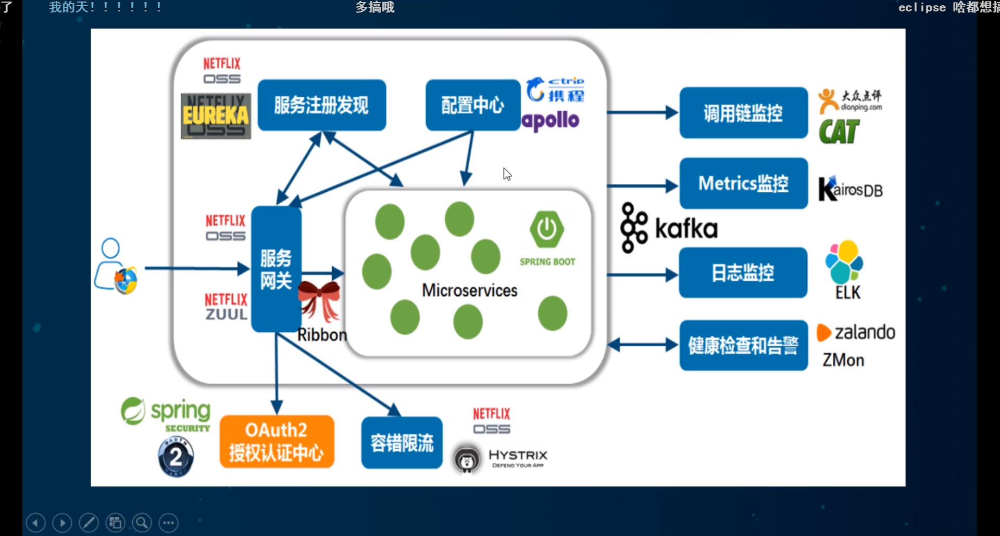

netflix == > 美国版的爱奇艺

目前我们主要讲主流的7,8种

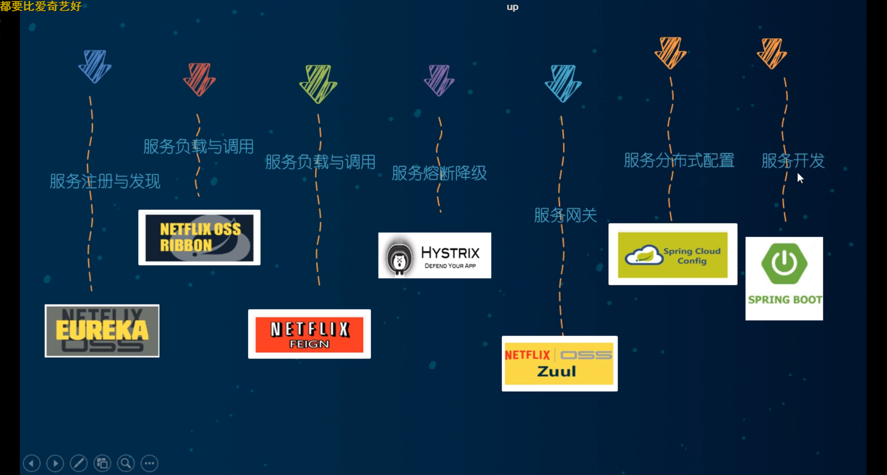

天上飞的理念,必然有落地的实现,这些都是2020年以前的,目前还在升级优化

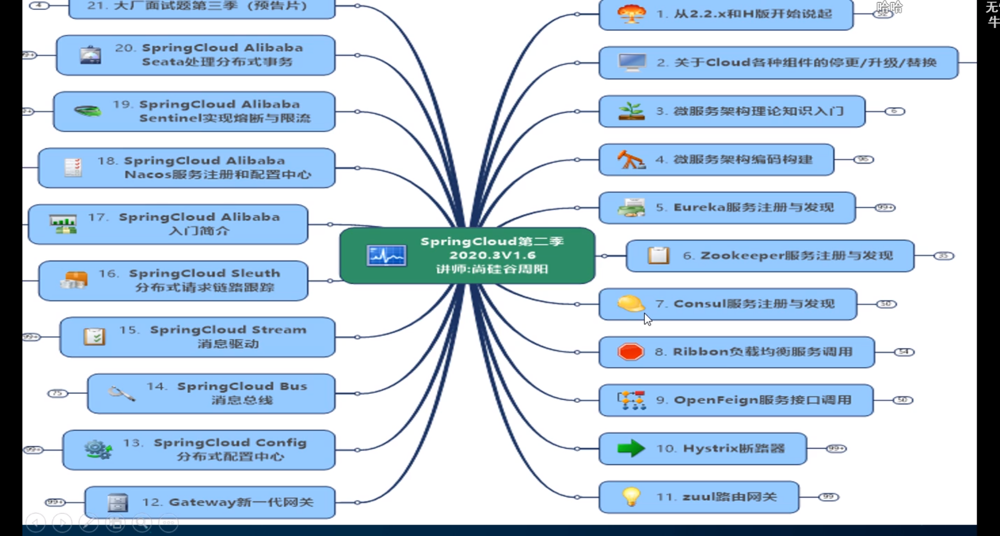